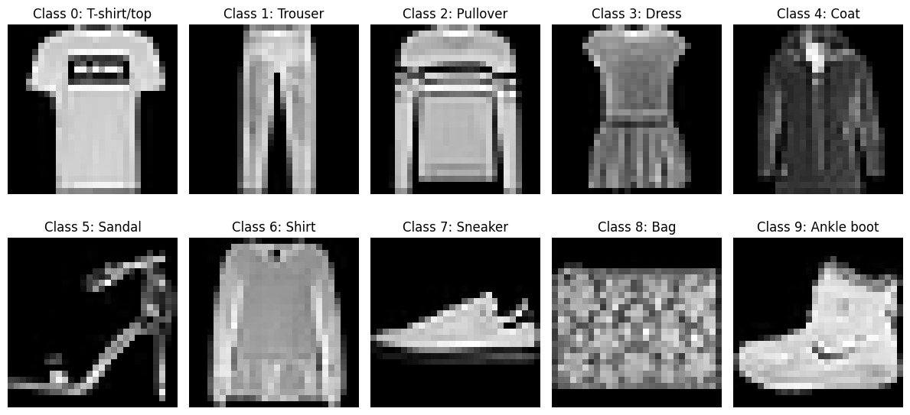
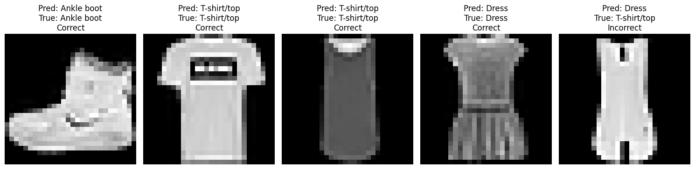
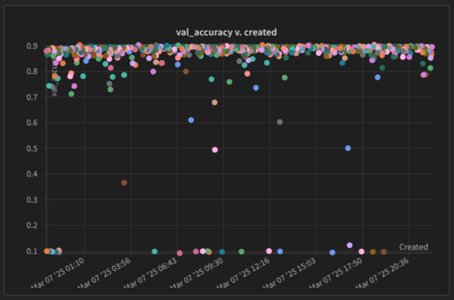
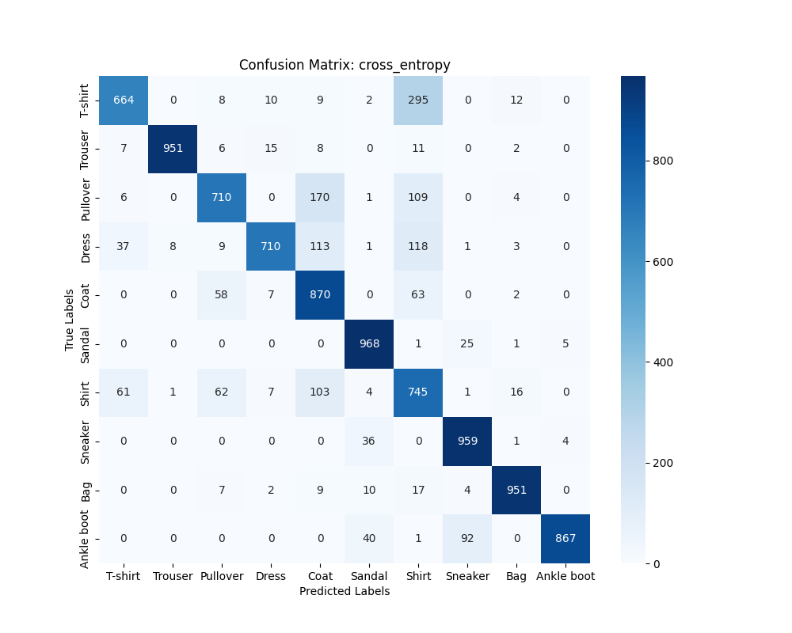

Author: Venkatesh H, NS24Z029

# DA6401 Assignment 1

This repository contains a complete implementation of a feedforward neural network from scratch using NumPy, along with multiple optimization algorithms (SGD, Momentum, Nesterov, RMSProp, Adam, Nadam). In addition, the code integrates with **wandb** for experiment tracking and hyperparameter sweeps using MNIST dataset.

## Table of Contents

- [Overview](#overview)
- [Project Structure](#project-structure)
- [Setup](#setup-for-this-project)
- [Instructions](#instructions)
  - [Running Experiments with `train.py`](#running-experiments-with-trainpy)
  - [Running Hyperparameter Sweep`](#running-hyperparameter-sweeps)
  - [Bash Script for Running an Experiment](#bash-script-for-running-an-experiment)
- [Assignment 1](#assignment-1)
  - [Question 1: Data Loading & Visualization](#question-1-data-loading--visualization)
  - [Question 2: Feedforward Neural Network](#question-2-feedforward-neural-network)
  - [Question 3: Backpropagation & Optimizers](#question-3-backpropagation--optimizers)
  - [Question 4: Hyperparameter Sweeps using wandb](#question-4-hyperparameter-sweeps-using-wandb)
  - [Question 5: Best Validation Accuracy Plot](#question-5-best-validation-accuracy-plot)
  - [Question 6: Experiment Insights & Recommendations](#question-6-experiment-insights--recommendations)
  - [Question 7: Test Set Evaluation & Confusion Matrix](#question-7-test-set-evaluation--confusion-matrix)
  - [Question 8: Loss Function Comparison (Cross Entropy vs. Squared Error)](#question-8-loss-function-comparison)
  - [Question 9: Github & WandB](#question-9-github--wandb)
  - [Question 10: Work for the MNIST dataset
](#question-10-work-for-the-mnist-dataset)
- [Arguments used](#arguments-used-in-this-project)

---

## Overview
This project implements a feedforward neural network from scratch using only NumPy and Pandas. The network supports multiple optimization algorithms and is built in a modular way such that the architecture can be easily modified. The experiments are tracked using **wandb**

---

## Project Structure

```
├── activation.py       # Contains all activation functions (e.g., ReLU, sigmoid, tanh) and their derivatives
├── Assignment.ipynb    # In this Notebook Contains the Answers from Question 1 yo 4.
├── feedforward_nn.py   # Defines the FeedForwardNN class implementing the network architecture and forward/backward passes
├── images              # Contains Output Images    
├── optimizer.py        # Implements the optimizer classes (SGD, Momentum, Nesterov, RMSProp, Adam, Nadam)
├── run.sh              # Bash script to run training with a set of command-line parameters
├── sweep.py            # Contains the wandb sweep configuration and parameters to start the hyperparameter sweep
├── train.py            # Main training script; parses command-line arguments, integrates wandb, and runs training and evaluation
├── utils.py            # Contains helper functions (e.g., argument parsing, data splitting, plotting utilities, etc.)
├── README.md           # README file
└── requirements.txt    # Python dependencies
```

---

## Setup for this project

**Create a Virtual Environment and Install Dependencies:**

```bash
setup.sh
```
---

## Instructions

### Running Experiments with `train.py`

To train your neural network with a specific configuration, run:

```bash
python train.py --wandb_project myproject --wandb_entity myname --epochs 5 --batch_size 32 --loss cross_entropy --optimizer adam --learning_rate 0.001 --num_layers 3 --hidden_size 64 --activation relu 
```

### Running Hyperparameter Sweeps

To run a hyperparameter sweep, use the provided sweep configuration:

1. **Create the Sweep:**

```bash
sweep.py 
```

### Bash Script for Running an Experiment

You can also use the provided `run.sh` script to run an experiment with all the parameters:

```bash
run.sh
```
---

## Assignment 1

### Question 1: Data Loading & Visualization

- **Task:** Download the fashion-MNIST dataset and plot 1 sample image for each class as shown in the grid below. Use `from keras.datasets import fashion_mnist` for getting the fashion mnist dataset.
- **Implementation:**  
  - Load dataset, iterate through training samples to collect one sample per class, and create a grid plot (2×5) using matplotlib added in `Assignment.ipynb`
  - Log the image grid to wandb.


### Question 2: Feedforward Neural Network

- **Task:** Implement a feedforward neural network which takes images from the fashion-mnist data as input and outputs a probability distribution over the 10 classes.

- **Implementation:**  
  - The `FeedForwardNN` class in `feedforward_nn.py` implements the forward pass.
  - Feedforward neural network for a set of configuration on the first five image data and got the probability distribution over the 10 classes in `Assignment.ipynb`.


### Question 3: Backpropagation & Optimizers

- **Task:** Implement backpropagation and support for multiple optimizers (SGD, momentum, Nesterov, RMSProp, Adam, Nadam).
- **Implementation:**  
  - `FeedForwardNN.backward()` computes gradients for cross entropy loss.
  - `FeedForwardNN.backward_mse()` computes gradients for squared error loss.
  - Optimizer classes (SGD, Momentum, etc.) are implemented in `optimizer.py` and `Assignment.ipynb`.

### Question 4: Hyperparameter Sweeps using wandb

- **Task:** Use wandb’s sweep functionality to search across various hyperparameters. Use the standard train/test split of fashion_mnist. Keep 10% of the training data aside as validation data for this hyperparameter search. 
- **Implementation:**  
  - `sweep.py` defines the search space and added in `Assignment.ipynb`.
  - The training function logs hyperparameter values and key metrics in `wandb` .
  - Runs are named meaningfully (e.g., `"hl_3_bs_32_ac_relu_loss_cross_entropy"`) for easy identification in wandb.
- **Parameter Used:**  
```json
{
    'epochs': {'values': [5, 10, 15, 20]},
    'hidden_layers': {'values': [3, 4, 5, 6, 7]},  
    'hidden_size': {'values': [32, 64, 128, 256]}, 
    'weight_decay': {'values': [0, 0.0005, 0.5]},  
    'learning_rate': {'values': [0.0001, 0.001, 0.01, 0.1]},
    'optimizer': {'values': ['sgd', 'momentum', 'nagd', 'rmsprop', 'adam', 'nadam']},
    'batch_size': {'values': [8, 16, 32, 64]}, 
    'weight_init': {'values': ['random', 'xavier']},
    'activation': {'values': ['sigmoid', 'tanh', 'relu']}, 
    'input_size': {'value': 784},  
    'output_size': {'value': 10},  
    'epsilon':{ 'values': [1e-8, 1e-7, 1e-6]},
    'beta': {'values': [0.9, 0.99, 0.999]}, 
    'momentum': {'values': [0.8, 0.9, 0.95]},  
}
```
### Question 5: Best Validation Accuracy Plot

- **Task:** Generate and add a panel to report the best validation accuracy across runs.
- **Implementation:**  
  - The training script logs `val_accuracy` in `wandb` to find the best validation accuracy across runs.



### Question 6: Experiment Insights & Recommendations

- **Task:** Analyze experiments using wandb’s parallel coordinates and correlation plots.
- **Implementation:**  
  - Wandb plots are used to visualize relationships among hyperparameters and performance.
  - In the final report, include a section with bullet-point insights and recommended configurations for achieving high accuracy.

  |**Parameter** |**Recommended Value**|
  |---------------------|-------------------|
  |Activation Function  |	relu              |
  |Optimizer	          | adam or nadam     |
  |Learning Rate	      | 0.0001            |
  |Hidden Layers        |	4 to 6            |
  |Hidden Size	        | 256 neurons/layer |
  |Batch Size	          | 8 or 16           |
  |Weight Initialization|           	xavier|
  |Weight Decay       	| 0.0005 or 0.0     |
  |Epochs	              | 30 to 50          |


### Question 7: Test Set Evaluation & Confusion Matrix

- **Task:** Evaluate the best model on the MNIST test set and plot a confusion matrix.
- **Implementation:**  
  - After training, the best model is evaluated based on the best hyperparameter setings.
  - A confusion matrix is computed and plotted.
  - The plot is logged to wandb for report.
  -  The model which gave the highest validation accuracy of 88.32%. The corresponding Testing Accuracy is 87.53%

| `Hyperparameter` | `Value` |
|---------------------|----------------------|
| Activation  | relu| 
| batch size  | 32| 
| beta  | 0.9| 
| epochs | 20| 
| epsilon | 0.000001|
| hidden layers  | 3 |
| hidden size  | 256|
| learning rate  | 0.0001| 
| momentum  | 0.95| 
| optimizer  | nadam| 
| weight decay  | 0.0005|
| weight init  | xavier| 
| train accuracy  | 0.9444| 
| train loss  | 0.1771|
| validation accuracy | 0.8991|
| validation loss  | 0.3021| 


### Question 8: Loss Function Comparison

- **Task:** Compare cross entropy loss with squared error loss.
- **Implementation:**  
  - The sweep and training function ran with cross entropy and MSE to compare the diffrence. 
  - Experiments with each loss type to visualize differences in convergence and accuracy.
### Question 9: Github & WandB

- **Task:** GitHub & WandB
- **Implementation:**  
  - Github Repo Link: [Github Repo](https://github.com/venkatesh19v/da6401_assignment1.git)
 
  - WandB Report Link: [WandB Report](https://github.com/venkatesh19v/da6401_assignment1.git)
### Question 10: Work for the MNIST dataset

- **Task:** Experimentation with MNIST dataset
- **Implementation:**  
  - All configurations performed very well, achieving over 97% accuracy, validating that our Fashion-MNIST learnings transferred effectively to MNIST (digit classification).

### Arguments used in this project: 
| Flag                | Argument Name        | Default Value | Description                                                           |
|---------------------|----------------------|---------------|-----------------------------------------------------------------------|
| `--dataset`          | `fashion_mnist`     |     `fashion_mnist`          | Choices: `["mnist", "fashion_mnist"]`                                 |
| `--epochs`           | `1`                 | `1`           | Number of epochs to train neural network                               |
| `--batch_size`       | `4`                 | `4`           | Batch size used to train neural network                                |
| `--loss`             | `cross_entropy`     | `cross_entropy` | Choices: `["mean_squared_error", "cross_entropy"]`                   |
| `--optimizer`        | `sgd`               | `sgd`         | Choices: `["sgd", "momentum", "nag", "rmsprop", "adam", "nadam"]`     |
| `--learning_rate`   | `0.1`               | `0.1`         | Learning rate used to optimize model parameters                        |
| `--momentum`         | `0.5`               | `0.5`         | Momentum used by momentum and nag optimizers                           |
| `--beta`          | `0.5`               | `0.5`         | Beta used by rmsprop optimizer                                         |
| `--beta1`        | `0.5`               | `0.5`         | Beta1 used by adam and nadam optimizers                                |
| `--beta2`        | `0.5`               | `0.5`         | Beta2 used by adam and nadam optimizers                                |
| `--epsilon`        | `0.000001`          | `0.000001`    | Epsilon used by optimizers                                             |
|`--weight_decay`   | `0.0`                | `0.0`          | Weight decay used by optimizers                                        |
| `--weight_init`    | `random`            | `random`      | Choices: `["random", "Xavier"]`                                       |
|`--num_layers`     | `1`                 | `1`           | Number of hidden layers used in feedforward neural network             |
| `--hidden_size`     | `4`                 | `4`           | Number of hidden neurons in a feedforward layer                        |
| `--activation`       | `sigmoid`           | `sigmoid`     | Choices: `["identity", "sigmoid", "tanh", "ReLU"]`                    |

---
---

- The project uses datasets from [Keras Datasets](https://keras.io/api/datasets/) and is tracked using [Weights & Biases](https://wandb.ai).
---
